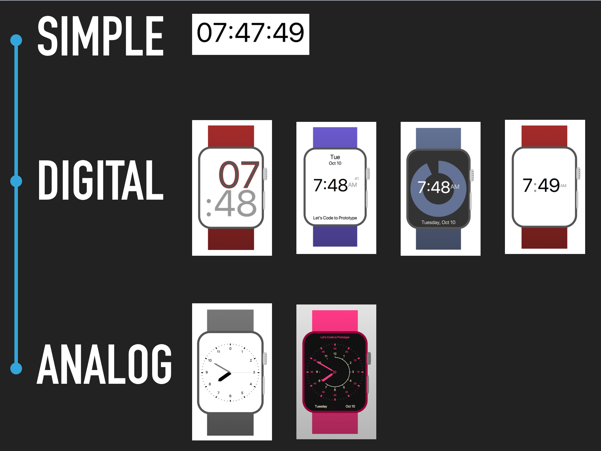

## Prototyping with React

> Welcome to the Workshop on **Prototyping with Code!**

## Getting Started

- Clone this repository
- Make sure you have [Node.js](https://nodejs.org/en/download/) installed and have it on your path
- Run `npm install` inside the cloned folder
- Run `npm start`
- Your browser should open to [http://localhost:3000](http://localhost:3000)

> Let the fun begin!

## What are we doing?

- Learning JavaScript
- Learning React
- Thinking in Components
- Building a set of Watch Faces!

## What are we using?

- [JavaScript](https://css-tricks.com/lets-learn-es2015/), the lingua franca of the Web
- [React](https://reactjs.org/) as our UI Development framework
- [Moment.js](https://momentjs.com/) for displaying formatted time
- [SVG](https://css-tricks.com/lodge/svg/) for all the vector graphics
- [Howler.js](https://howlerjs.com/) for the tick sound in **Analog Face 2**
